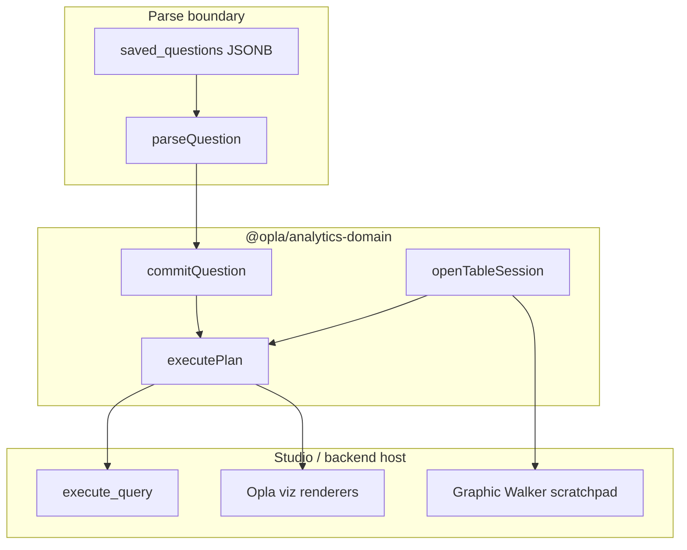

# Module map

One package, thin public surface, rich internals. Studio and backend both depend on `@opla/analytics-domain`. Backend re-implements parse/validate in Pydantic against the same fixtures; it does not import TypeScript.

```
packages/analytics-domain/
├── package.json                 # zero runtime deps; dev: vitest, zod (boundary parse only)
├── src/
│   ├── index.ts                 # PUBLIC: 7 functions + types (see usage.md)
│   │
│   ├── ids.ts                   # branded OrgId, DatasetId, FieldKey, fieldKey()
│   ├── source.ts                # CaptureDataset | AnalyticTable, listSources shape
│   ├── formula/
│   │   ├── compile.ts           # HyperFormula text → CalculatedExpr (uses host-injected HF in Studio only)
│   │   └── expr.ts              # CalculatedExpr AST + structural validators
│   ├── query/
│   │   ├── plan.ts              # QueryPlan v2, MeasureSpec, FilterGroup
│   │   ├── parse.ts             # parseQueryPlan, upgradeQueryConfigV1
│   │   └── validate.ts          # plan/source field existence, limit bounds
│   ├── lens/
│   │   ├── kinds.ts             # Table | Chart | Map | Kpi | Markdown discriminated union
│   │   ├── validate.ts          # validateLens(plan, lens, source) — illegal pairings fail here
│   │   └── upgrade.ts           # legacy viz_type → Lens; rejects walker
│   ├── question/
│   │   ├── model.ts             # SavedQuestion, QuestionView, QuestionCommit
│   │   ├── parse.ts             # parseQuestion — migration boundary
│   │   └── commit.ts            # commitQuestion orchestration (validate then client.saveQuestion)
│   ├── session/
│   │   ├── table.ts             # TableSession, openTableSession
│   │   └── scratchpad.ts        # Scratchpad, openScratchpad — Walker seed only
│   ├── execute.ts                 # executePlan — always client.runQuery, no client agg
│   ├── dashboard.ts             # AnalysisDashboard, DashboardCard (types + parse only)
│   ├── report.ts                  # OrgReport, TeamGrant, ReportBlock
│   └── hub.ts                     # ProjectHubPin, assertPinnable
│
└── test/
    ├── fixtures/
    │   ├── legacy-saved-questions/   # real JSON blobs from saved_questions
    │   └── query-parity/             # builder vs dashboard expected rows
    ├── parse.test.ts
    ├── lens-validation.test.ts
    ├── formula-compile.test.ts
    └── parity.test.ts
```

## Public vs internal

| Exported from `index.ts` | Stays internal |
|--------------------------|----------------|
| `parseQuestion`, `parseQueryPlan` | `upgradeQueryConfigV1`, `upgradeVizConfig` |
| `openTableSession`, `openScratchpad` | Walker adapter (lives in Studio `walkerAdapter.ts`) |
| `commitQuestion`, `executePlan`, `questionView` | HyperFormula instance |
| All domain types in `types.ts` sketch | `AnalyticsClient` implementation (Studio `lib/analyticsClient.ts`) |

Seven functions. Callers never import `session/table.ts` directly.

## Backend mirror (Python, not in this package)

```
opla-backend/app/
├── models/
│   ├── analytic_tables.py       # NEW: replaces Form minting for derived tables
│   └── analytics.py             # SavedQuestion keeps JSONB; parse via Pydantic v2 models
├── schemas/analytics_domain.py  # QueryPlan, Lens, ParseOutcome — parity with TS fixtures
└── services/
    ├── analytics_query.py       # execute_query reads QueryPlan v2 only after migration gate
    └── analytic_table_service.py # create_table(snapshot|linked), no Form.create
```

## Studio wiring (delete, don't wrap)

| Retired top-level product | Becomes |
|---------------------------|---------|
| `PrepTable.tsx` | `ProjectAnalysisTable` using `openTableSession` |
| `WalkerAnalysisLab.tsx` Charts tab | `QuestionComposer` + `commitQuestion` |
| `WalkerAnalysisLab.tsx` Explore tab | `session.openScratchpad()` only |
| `SpatialAnalysisLab.tsx` | deleted; map lens in composer |
| `DashboardCanvas` stub question creator | deleted |
| `reportBuckets.ts` | deleted; `OrgReports` uses `AnalyticsClient.createReport` |
| `QuickChart` client aggregation | deleted; preview via `session.preview()` / `executePlan` |

## Data flow



## Test harness as the lever

`test/parity.test.ts` loads fixture questions, runs `executePlan` against a recorded `QueryResult`, and asserts dashboard re-query equals composer preview. Backend runs the same fixtures in pytest. This is the proof Phase A demands before grid/map features land.
