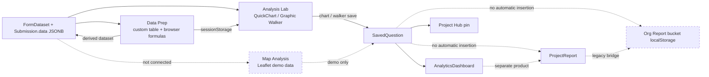

# How Opla analysis works today

Synthesized from four how-explorers, 2026-08-19. Explainer: architecture synthesis.

### Overview

Opla’s current data-analysis product is a thin analytics layer over form submissions. Published forms produce `FormDataset` metadata and `Submission.data` JSONB rows; Studio then offers several ways to inspect or reshape those rows. The backend has a real query engine and real saved analytics objects, but the Studio experience is only partially wired into the surrounding product.

The reliable path today is:

`FormDataset` / submissions → Analysis Lab or Prep → saved chart/question → dashboard card and/or Project Hub pin.

Maps and the broader Reports experience sit beside that path rather than completing it. Maps are a demo surface, while reports exist in two incompatible implementations: project reports persisted by the backend and org-level report boards stored in browser `localStorage`.

### Key Concepts

- **`FormDataset` / `Submission`** — The actual analytics warehouse. Dataset fields are persisted relationally, while submission values live in JSONB. There is no separate OLAP warehouse.
- **Analytics source** — The Studio representation of a dataset returned by `AnalyticsService.list_sources`.
- **Analysis Lab** — A Studio UI mode, not a persisted object. It has:
  - **Charts**, implemented by `QuickChart` and ECharts.
  - **Explore**, implemented by Graphic Walker.
- **Data Prep** — A Studio working mode. Its grid state is temporary unless the user saves a derived dataset.
- **Derived dataset** — A real dataset created by Prep. It is implemented as a new LIVE `Form`, `FormDataset`, schema version, fields, and optionally `Submission` rows.
- **`SavedQuestion`** — The central reusable analytics artifact in `saved_questions`. It stores `source_config`, `query_config`, `viz_type`, and `viz_config`.
- **`AnalyticsDashboard` / `DashboardCard`** — Persisted dashboards. A dashboard owns cards; each card must reference a `SavedQuestion`.
- **Project Hub pin** — A separate persisted join between a project and a saved question. Projects may have at most four pins.
- **`ProjectReport`** — A real project-scoped backend object with JSONB canvas content and accessor fields.
- **Org report bucket** — A different, browser-local report implementation in `reportBuckets.ts`.
- **Spatial / Map Analysis** — A UI mode backed by hardcoded demo data. It is not currently connected to datasets or saved analytics objects.
- **Walker** — Graphic Walker’s exploration format. It can be saved as a `SavedQuestion` with `viz_type="walker"`, but dashboards do not render it yet.

### How It Works

#### 1. Data enters through forms or CSV

The backend treats published forms as queryable datasets. `AnalyticsService.list_sources` joins `FormDataset` to its `Form`, loads active fields, and reports record counts and derived-dataset metadata.

Studio’s `AnalyticsHub` loads these sources using `analyticsAPI.listSources(orgId)`. If none exist, it asks the user to publish a form or upload a CSV.

CSV upload is implemented in `POST /organizations/{org_id}/analytics/upload-csv`. The route:

1. Parses the CSV.
2. Infers each column as either `number` or `string`.
3. Creates a mock `Form`.
4. Creates an active `FormDataset` and fields.
5. Writes every CSV row as a `Submission`.

This makes CSV data look like form data to the rest of the analytics system. The implementation is currently fragile: the Studio upload path hardcodes `http://localhost:8000`, and generated CSV form/submission columns do not line up correctly.

The query engine is `AnalyticsService.execute_query` in `opla-backend/app/services/analytics_service.py`. It supports:

- One `dataset_id` per query.
- Selected fields.
- Nested filter rule groups with `and` / `or`.
- `group_by`, including date buckets through `date_trunc`.
- `count`, `sum`, `avg`, `min`, and `max`.
- Ordering, limits, and offsets.
- A restricted calculated-field AST supporting arithmetic such as `+`, `-`, `*`, and `/`.

Values are read from JSONB as text and cast to `Float` for numeric operations. Rejected submissions are not excluded because the query engine does not apply a `review_status` filter.

There is a backend `POST /compare` endpoint for period comparisons, but Studio does not call it. Similarly, the backend accepts `calculated_fields`, but the main Studio query helper does not send them.

#### 2. Prep is a custom, mostly display-only spreadsheet

`PrepTable.tsx` is described as an Excel-like grid, but it is not an editable spreadsheet engine. It uses a custom HTML table. The editable spreadsheet-like surface elsewhere in Studio is `DirectoryGrid`, which belongs to operations/directory management, not analytics.

Prep currently does the following:

1. Selects a dataset.
2. Calls `analyticsAPI.runQuery` with up to 5,000 rows and no filters or sort.
3. Displays the first 500 painted rows.
4. Allows columns to be shown, hidden, resized, and searched.
5. Displays choice fields as labels or raw values.
6. Lets the user add calculated columns.

Formula evaluation happens in the browser through `excelFormulas.ts` and HyperFormula-style logic. Calculated columns use formulas such as `[Column] * 2`. The formulas are evaluated against the rows currently in memory, and calculated columns are always typed as numbers.

Prep does not provide cell editing, fill-down, undo, sorting, row filtering, joins, named ranges, copy/paste, pagination, virtualization, or normal spreadsheet export. It also cannot update an existing derived table; saving always creates another one.

The formula architecture is split:

- Prep formulas run in the browser.
- Backend `calculated_fields` uses a separate, smaller arithmetic AST.
- Studio’s normal `runQuery` path omits `calculated_fields`.
- Linked derived datasets deliberately call the backend with `calculated_fields=None`, then reapply Prep formulas in the browser.

When the user clicks “Open in Lab”, Prep serializes the loaded rows and columns into a one-shot `sessionStorage` payload. It navigates to `/dashboard?tab=analysis&tool=lab&from=prep`. The `from=prep` query parameter itself is not the mechanism that carries the data; the session-storage handoff is. The Lab consumes and deletes that payload.

#### 3. Saving Prep creates a LIVE form and dataset

Prep has two save modes:

- **Snapshot** — The current rows are copied into new `Submission` rows.
- **Linked** — The new dataset stores metadata pointing at the parent dataset and selected columns; queries are redirected to the parent at runtime.

`AnalyticsService.create_derived_dataset` creates:

1. A new `Form` with `status=LIVE` and `published_version=1`.
2. A new active `FormDataset`.
3. A schema version.
4. Dataset fields.
5. Snapshot submissions when applicable.
6. Metadata identifying the dataset as `kind="derived"` and `created_from="prep"`.

This means Prep is not creating an independent analytics-table abstraction. It is creating live forms that appear in the normal form catalog, usually with `prep-*` slugs.

For linked datasets, `execute_query` resolves the parent dataset and runs the query there. The derived dataset’s saved calculated formulas are not executed by the backend; Prep reapplies them to the returned rows.

#### 4. Lab loads data locally or delegates Walker computation

`WalkerAnalysisLab.tsx` has two modes:

- **Charts** — `QuickChart` renders ECharts locally.
- **Explore** — Graphic Walker renders an interactive exploration.

For ordinary datasets, Lab requests up to 2,000 rows. For larger datasets, it requests only 25 preview rows and supplies Graphic Walker with a `computation` callback to `POST /organizations/{org_id}/analytics/walker/{dataset_id}/compute`.

The Walker compute endpoint is separate from `execute_query`. It ignores Prep transform steps, returns HTTP 200 even when computation fails, and its JWT protection does not perform an organization-membership check.

When Lab receives the Prep handoff, it bypasses the normal Lab row cap and uses the rows already placed in `sessionStorage`.

#### 5. Charts are the strongest save path

`QuickChart` supports bar, grouped, stacked, horizontal bar, line, pie, and scatter charts. It aggregates the rows in the browser for display, while simultaneously constructing a backend-compatible `query_config` (`group_by`, `aggregates`, `select_fields`, `limit`).

When the user saves a chart, `WalkerAnalysisLab.handleSaveAnalysis` creates a `SavedQuestion` with `viz_type="chart"`. This is the most complete user-facing analytics flow: Lab → Charts → Save → SavedQuestion.

Explore can also be saved as `viz_type="walker"`. The save dialog explicitly warns that Walker analyses are not currently usable as Project Hub pins.

#### 6. Questions are persisted, but the “New Question” composer is mostly a stub

The API supports create, list, get, update, and delete. Lists can be filtered by `project_id`.

`DashboardCanvas.handleCreateQuestion` selects the first six fields of the chosen dataset and saves with no filters, grouping, aggregates, or ordering, limit 50. The UI acknowledges this creates a stub. Real chart questions should be produced from Lab.

The model permits `table | chart | walker | kpi | goal | markdown`, but composers for KPI, goal, and markdown are incomplete. `DashboardCard.question_id` is non-null, so even markdown cards must point at a question.

#### 7. Dashboards re-query their questions at view time

`AnalyticsService.update_dashboard` replaces all cards when `cards` is supplied. Card IDs therefore churn on every replacement.

`DashboardViewer` re-runs each question’s query. Implemented: chart/table via ECharts, KPI, goal, rich-text, chart-click drill-through, cross-filter, raw rows, client CSV of drill rows.

The “All Regions” selector updates `globalFilters.region` but does not inject that value into card queries. `position` is stored but unused. `layout_config` tabs are unused. Walker cards show a placeholder. KPI `previousValue` / `comparePeriod` are not wired. Goal targets default to `1000`.

#### 8. Project Hub pins are a separate projection of saved questions

Stored in `ProjectPinnedAnalytics`, max four. Supports only `chart | kpi | goal | table`. Walker, markdown, and maps cannot be pinned.

#### 9. Maps are currently a disconnected demo

`SpatialAnalysisLab.tsx` uses hardcoded `DEMO_AREAS` and `DEMO_STORES`. GPS exists in capture, Prep, and Walker flatten, but Spatial does not read any of those sources. No saved map artifacts, map `viz_type`, GeoJSON joins, share, or export.

Reports do not automatically become dashboards, and dashboards do not automatically become report-canvas blocks.

### Where Things Live

Backend: `opla-backend/app/models/analytics.py`, `project_report.py`, `project_pinned_analytics.py`, `services/analytics_service.py`, `api/routes/analytics.py`, `api/routes/projects.py` (pins), `services/project_report_service.py`.

Studio: `components/analytics/{AnalyticsHub,PrepTable,excelFormulas,prepSession,WalkerAnalysisLab,QuickChart,DashboardCanvas,DashboardViewer,SpatialAnalysisLab}.tsx`, `lib/reportBuckets.ts`, `pages/{ReportBoard,ReportDetail,Dashboard}.tsx`.

### Gotchas

- Analytics navigation is orphaned. Submenu exists; no caller wires `onSelectAnalyticsTool`. Hub mounts with `projectId={undefined}`.
- Two Reports products: backend `project_reports` vs `localStorage` org boards.
- Reports are not dashboards.
- Prep creates LIVE forms (`prep-*`).
- Maps are a demo.
- Sharing is org membership, not artifact ACL. No public link, collections, scheduled email.
- Query-builder JSON exists on the backend; no Studio Data Explorer drives it.
- Disconnected formula engines (HyperFormula vs AST vs unused).
- `cache_ttl_seconds` is decorative.
- No automated analytics-service tests.
- Three competing docs: `ANALYTICS_MODULE_DEV_GUIDE.md`, `DATA_ANALYSIS_PLATFORM_PLAN.md`, `GRAPHIC_WALKER_EMBED_PLAN.md`. They overstate Data Explorer / Chart Builder / Pivot / Spreadsheet.
