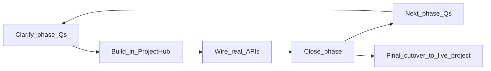

# Project Command Centre — Phased Roadmap

**Status:** Active  
**Reference mock:** `/pdemo` → evolve into **ProjectHub** ([`opla-frontend/apps/studio/src/pages/ProjectDemo.tsx`](../opla-frontend/apps/studio/src/pages/ProjectDemo.tsx))  
**Live target (final cutover):** project home in [`ProjectWorkspace.tsx`](../opla-frontend/apps/studio/src/pages/ProjectWorkspace.tsx) (or successor), after ProjectHub is complete  

---

## Goals

Build a **read-oriented project command centre**: stream project signals in, deep-link out to tools. It is not an editing workbench.

- Universal health stats + “Today”
- Progress, teams, report links
- Forms · Catalogs · Datasets hub (Launch / Open destinations)
- Derived Needs Attention
- Form media library → recent media on Overview
- Proper threads
- Optional automation → `create_alert`
- Maps under Analysis (later)

## Non-goals (explicit cuts)

- Hub Resources KPI  
- Favourites / stars  
- One-size-fits-all “Avg Response Rate” (replaced by universal stats + pinned charts)  
- Shipping a full map product inside early Overview phases  

---

## Build strategy

1. **Develop everything in ProjectHub** (today: `ProjectDemo` at `/pdemo`).  
2. **Rename** demo page/file to ProjectHub when the shell is stable (route may become `/project-hub` or stay `/pdemo` until cutover — decide in Phase 1 answers).  
3. **Wire live APIs into ProjectHub** phase by phase (mock → real per slice).  
4. **Only after phases are complete**, cut over: make ProjectHub the live project home (replace or wrap current ProjectWorkspace landing).  

Do **not** dual-maintain Overview on ProjectWorkspace during intermediate phases unless a phase explicitly says so.

---

## Process (hard gate every phase)

| Step | Rule |
|------|------|
| **1. Clarify** | Agent asks that phase’s clarifying questions. **No build** until answers are written under **Answers**. |
| **2. Build** | Implement only that phase’s in-scope work in ProjectHub (+ backend if required). |
| **3. Wire-in** | Replace mock data for that slice with real APIs where the phase says so. |
| **4. Close** | Mark phase **Done** when acceptance criteria pass. Then start the next phase’s questions. |

**Current phase pointer:** Phase 1 — Done (verify); next = Phase 1.5 clarifying

---

## Phase 0 — Scope lock

### Intent
Record decisions already made so later phases don’t reopen cuts.

### In scope
- Document goals, non-goals, ProjectHub-first strategy, phase list.

### Out of scope
- Code.

### Answers

| Decision | Answer |
|----------|--------|
| Doc path | `docs/Project-Command-Centre-Phases.md` |
| Where to build | ProjectHub (evolve from PDemo); cut over to live project page when complete |
| Rename | Demo file → ProjectHub when shell is stable |
| Cuts | No Hub Resources, no favourites, no generic Avg Response Rate |

### Status
**Done**

---

## Phase 1 — ProjectHub shell + wire existing data

### Intent
Turn ProjectHub into the real command-centre shell using **data and APIs that already exist**. Keep layout close to the current `/pdemo` Overview + Workspace tabs.

### In scope
- Rename `ProjectDemo` → `ProjectHub` (file, component, route naming as agreed in Answers).
- Overview: KPI strip (universal only), Today strip, work progress, teams, report links.
- Workspace tab: Forms · Catalogs · Datasets with clear destinations (`Open form` / `Open catalog` / `Explore dataset`).
- Wire ProjectHub to a **selected real project** (org + project context) for live counts/lists.
- Hide or clearly label unfinished slices (alerts, map, chat, media carousel) as “Coming in Phase N”.

### Out of scope
- Needs Attention feed (Phase 2)  
- Media library (Phase 3)  
- Threads product (Phase 4)  
- Maps (Phase 6)  
- Cutover to ProjectWorkspace as default project home (final cutover)  

### Depends on
- Existing: forms, submissions/review, tasks, attendance, teams/access, reports, catalogs, datasets/analytics sources.

### Clarifying questions (blockers)

1. Which **universal KPIs** ship in v1? (e.g. submissions total, pending review, open tasks, members on project — pick 3–4.)  
2. **Today** window: calendar day in org TZ, or rolling last 24 hours?  
3. How does ProjectHub pick the project while still a demo route — project switcher, query `?projectId=`, or hard-pick from current org?  
4. Exact **Launch destinations** for form / catalog / dataset (builder, simulator, workspace tab, analytics tool)?  
5. Final route name after rename: keep `/pdemo`, use `/project-hub`, or `/projects/:id/hub` early?  
6. Should unfinished Overview widgets be **hidden** or shown as **disabled placeholders**?

### Answers

| # | Answer |
|---|--------|
| 1 | **Total collected / expected total**; **This week / expected weekly**; **Pending review**; **Checked in today**. Targets come from project collection settings (below). |
| 2 | **Calendar day** (local browser date for Studio Today strip). Collection **time window** (default 09:00–17:00) is stored on the project for “is collection active now” and future enforcement. |
| 3 | Project from URL: **`/projects/:id/hub`**. |
| 4 | **Form** → `/builder/:formId`. **Catalog** → `/projects/:id?tab=catalog`. **Dataset** → `/dashboard?tab=datasets` (Analytics deeper links in later polish). |
| 5 | **`/projects/:id/hub`**. Rename page to ProjectHub; remove `/pdemo` (redirect to first accessible project hub or dashboard). |
| 6 | **Hide** unfinished widgets (alerts, map, chat, media) until their phases. |

**Project collection settings (required product properties — Phase 1):**

| Property | Rule |
|----------|------|
| `collection_start_date` / `collection_end_date` | Activate data collection period (date range). Required on create. |
| `collection_time_start` / `collection_time_end` | Daily window; **default 09:00–17:00**. |
| `expected_total_count` / `expected_weekly_count` | At least **one** must be set and ≥ 1. |

### Status
**In progress** — answers locked; build + wire underway

### Deliverables
- Project collection settings on model/API + create project UI.
- Renamed ProjectHub page at `/projects/:id/hub`.
- Overview + Workspace tabs wired to live project data for Phase 1 widgets.
- Unfinished slices hidden.

### Wire-in checklist
- [x] Project + org context loaded from `:id`
- [x] KPI values from submissions + expectations
- [x] Today strip from attendance / tasks / submissions / review
- [x] Progress from tasks (+ reports published)
- [x] Teams from project access / teams APIs
- [x] Report links → report detail
- [x] Workspace cards → real forms, catalogs, datasets
- [x] Create project requires collection settings

### Acceptance criteria
- Opening `/projects/:id/hub` shows live numbers for Phase 1 widgets.
- New projects require date range + at least one expectation target.
- No edit workbench on Overview (deep-link only); unfinished features hidden.

### Status
**Done** (Phase 1 build + wire complete — verify in Studio, then close formally)

---

## Phase 1.5 — Pinned analytics charts on Overview

### Intent
Replace project-specific vanity metrics with **admin-pinned charts** built in Analytics.

### In scope
- Pin/unpin chart (or dashboard card) to a project.  
- Render pinned charts on ProjectHub Overview.  
- Persist pin metadata (project-scoped).

### Out of scope
- New chart builder (use existing Analytics).  
- Alerts / media / threads.

### Depends on
- Phase 1 closed.  
- Existing Analytics dashboards/cards.

### Clarifying questions (blockers)

1. What can be pinned — single EChart/KPI card, whole dashboard, or both?  
2. Who may pin — project editor, org admin, or broader?  
3. Max pins on Overview?  
4. Empty state when nothing pinned?

### Answers

| # | Answer |
|---|--------|
| 1 | |
| 2 | |
| 3 | |
| 4 | |

### Deliverables
- Pin model/API + Overview render slot.

### Wire-in checklist
- [ ] Save/load pins for project  
- [ ] Overview shows pinned charts with live data  

### Acceptance criteria
- Admin can pin at least one analytics view; it appears on ProjectHub Overview for that project.

### Status
**Not started**

---

## Phase 2 — Derived Needs Attention feed

### Intent
Project-scoped triage rail from **live operational state** (not “tasks pretending to be alerts”).

### In scope
- Alert (or attention-item) model + list API (severity, title, detail, deep-link, created/updated).  
- Detectors v1 from agreed signals (e.g. review backlog aging, blocked/overdue tasks, attendance gaps).  
- Needs Attention UI on ProjectHub Overview.  
- Ack / dismiss if Answers require it.

### Out of scope
- Automation `create_alert` (Phase 5).  
- Push/email delivery unless Answers demand a minimal in-app-only ack.

### Depends on
- Phase 1 (Overview shell).  
- Existing review queue, tasks, attendance.

### Clarifying questions (blockers)

1. Which **signals** are in v1 (ordered by priority)?  
2. Severity rules (what is critical vs warning vs info)?  
3. Ack/dismiss required in v1, or read-only feed?  
4. Deep-link targets per signal type?  
5. Recompute on read, cron, or event hooks?

### Answers

| # | Answer |
|---|--------|
| 1 | |
| 2 | |
| 3 | |
| 4 | |
| 5 | |

### Deliverables
- Backend feed + ProjectHub rail wired to it.

### Wire-in checklist
- [ ] Replace mock `ALERTS`  
- [ ] Severity styling matches live data  
- [ ] Deep-links land on correct Studio surfaces  

### Acceptance criteria
- Creating backlog/block conditions in a test project surfaces matching attention items without manual mock data.

### Status
**Not started**

---

## Phase 3 — Form / dataset media library

### Intent
All media collected via a form (image / audio / video) lives in a **media storage section** for that form’s data. ProjectHub can show a recent-media carousel from project forms.

### In scope
- Media extraction/indexing from submissions (field types agreed in Answers).  
- Per-form media browse UI (Studio).  
- Storage approach per Answers.  
- ProjectHub Overview: recent media strip/carousel from project forms.

### Out of scope
- Full DAM / arbitrary file manager.  
- Map geotagging of media (can link later).

### Depends on
- Phase 1.  
- Submission payloads + existing upload/field types.

### Clarifying questions (blockers)

1. Storage backend for v1 (existing upload URLs only vs object storage migration)?  
2. Which blueprint field types count as media?  
3. Video in v1 or images + audio only?  
4. Retention / delete with submission?  
5. Mobile browse in v1 or Studio-only?

### Answers

| # | Answer |
|---|--------|
| 1 | |
| 2 | |
| 3 | |
| 4 | |
| 5 | |

### Deliverables
- Form media section + ProjectHub recent media wired.

### Wire-in checklist
- [ ] List media for a form  
- [ ] Overview carousel uses real media  
- [ ] Launch → form media section  

### Acceptance criteria
- Submitting a form with media makes items appear in that form’s media section and on ProjectHub recent media.

### Status
**Not started**

---

## Phase 4 — Proper threads

### Intent
Replace title/summary/`reply_count`-only threads (and Studio mocks) with a real conversation system for the project channel.

### In scope
- Message/reply model, APIs, authorship, timestamps.  
- Studio ProjectHub chat/stream UI.  
- Wire Studio away from hardcoded thread lists.  
- Permissions per Answers.

### Out of scope
- Presence / “online” unless Answers include a minimal last-active.  
- Full Slack-style channels product beyond project scope agreed in Answers.

### Depends on
- Existing `project_threads` table can be extended or replaced — decide in Answers.

### Clarifying questions (blockers)

1. One project channel vs multiple topic threads?  
2. Who can post (all project members, roles)?  
3. Edit/delete message policy?  
4. Notify on mention / new message in v1?  
5. Migrate or discard existing stub thread rows?

### Answers

| # | Answer |
|---|--------|
| 1 | |
| 2 | |
| 3 | |
| 4 | |
| 5 | |

### Deliverables
- Threads backend + ProjectHub stream + Studio API client (no mock lists).

### Wire-in checklist
- [ ] Remove hardcoded threads in ProjectHub / Dashboard / Workspace  
- [ ] Live list + post + reply  

### Acceptance criteria
- Two users can exchange messages on a project and see them on ProjectHub.

### Status
**Not started**

---

## Phase 5 — Automation action: `create_alert`

### Intent
Extend form automation so custom submission conditions can push into the Phase 2 attention feed.

### In scope
- New action type `create_alert` on form automation rules.  
- Reuse condition/template engine.  
- Show automation-origin alerts in Needs Attention (with provenance).

### Out of scope
- Replacing derived detectors (Phase 2 remains primary).  
- Non-submission events unless Answers expand event set.

### Depends on
- Phase 2 alert store.  
- Existing [`form_automation_service.py`](../opla-backend/app/services/form_automation_service.py).

### Clarifying questions (blockers)

1. Which events may create alerts (`submission_created` / `reviewed` / `approved`)?  
2. Alert fields from templates (title, detail, severity)?  
3. Dedupe rules (every match vs once per submission)?  
4. Who can configure rules (same as today’s automation UI)?

### Answers

| # | Answer |
|---|--------|
| 1 | |
| 2 | |
| 3 | |
| 4 | |

### Deliverables
- `create_alert` action + Studio automation UI option + feed integration.

### Wire-in checklist
- [ ] Rule fires → attention item visible on ProjectHub  
- [ ] Provenance shows automation rule  

### Acceptance criteria
- Test rule on approve/create produces a Needs Attention item without creating a task unless also configured.

### Status
**Not started**

---

## Phase 6 — Maps in Analysis

### Intent
Introduce a proper map surface (e.g. Leaflet) under **Analytics / Analysis**, using geo from attendance (and later submissions if available). ProjectHub may deep-link or show a thin summary later — not required to block earlier phases.

### In scope
- Map view in Analysis.  
- Plot agreed geo sources.  
- Docs for how ProjectHub will eventually consume it.

### Out of scope
- Full GIS platform.  
- Blocking Phase 1–5 on map polish.

### Depends on
- Attendance `location_json` (and any later submission geo).  
- Phase 1 at minimum for product context.

### Clarifying questions (blockers)

1. Library choice confirmed (Leaflet vs other)?  
2. v1 data source: attendance only, or also task/submission geo?  
3. Privacy/retention for precise coordinates?  
4. Analysis-only in v1, or also Overview embed/deep-link?

### Answers

| # | Answer |
|---|--------|
| 1 | |
| 2 | |
| 3 | |
| 4 | |

### Deliverables
- Analysis map view + documented ProjectHub integration path.

### Wire-in checklist
- [ ] Live pins from agreed source  
- [ ] ProjectHub link or summary if Answers require  

### Acceptance criteria
- Check-ins with coordinates appear on the Analysis map for that project.

### Status
**Not started**

---

## Final cutover — ProjectHub → live project home

### Intent
When Phases 1–5 are Done (Phase 6 may still be in progress if Analysis-only), replace the current project landing experience with ProjectHub.

### Clarifying questions (at cutover time)

1. Replace ProjectWorkspace landing entirely, or embed ProjectHub as default tab and keep ops tabs?  
2. Redirect `/projects/:projectId` → ProjectHub route?  
3. Deprecate `/pdemo`?

### Answers

| # | Answer |
|---|--------|
| 1 | |
| 2 | |
| 3 | |

### Acceptance criteria
- Opening a project from Dashboard lands on the command centre with live data.  
- Ops editing remains reachable via deep-links / tabs, not by turning Overview into a builder.

### Status
**Not started**

---

## Phase status summary

| Phase | Name | Status |
|-------|------|--------|
| 0 | Scope lock | Done |
| 1 | ProjectHub shell + existing data | Done (verify in Studio) |
| 1.5 | Pinned analytics charts | Not started |
| 2 | Needs Attention feed | Not started |
| 3 | Form media library | Not started |
| 4 | Proper threads | Not started |
| 5 | Automation `create_alert` | Not started |
| 6 | Maps in Analysis | Not started |
| Final | Cutover to live project home | Not started |

---

## How to start Phase 1

Reply with answers to **Phase 1 clarifying questions** (or say “ask me Phase 1 questions” and answer in thread). Answers get copied into this doc, then build + wire begins in ProjectHub only.
